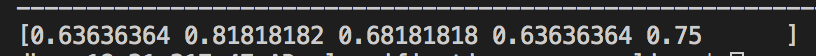

# AD_classification

Alzheimer's Dementia Recognition through Spontaneous Speech

## Run
Set config parameters and then `python main.py`

### Compare features extraction

* First download the [opensmile](https://www.audeering.com/opensmile/) toolkit.
* Unpack downloaded file using tar -zxvf openSMILE-2.x.x.tar.gz
* Go inside extracted directory cd openSMILE-2.x.x
* Use this command bash autogen.sh or sh autogen.sh
* Use these commands make -j4 ; make
* finally use make install
=======

## SVM experiment
### 10 features
Tried for different values of C and gamma, best values C = 10, gamma = 0.5
5 folds, these are the results

### 11 features

Tried svm on 11 features

### Paper notes

offline training say on phone or webapp, edge ML.
one of top 5 causes of deaths - verify (cite source).
remove intervention count/rate from pause_features.
compare counts vs rates as features.
establish individual model baselines, compare to ensemble (different types of voting).

### Model submissions

1. trained on full dataset (soft or log reg).
2. 4th out of 5 fold upon monitoring val loss (log reg voting).
