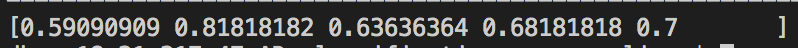

# AD_classification

Alzheimer's Dementia Recognition through Spontaneous Speech

## SVM experiment

tried for different values of C and gamma, best values C = 10, gamma = 0.5
5 folds, these are the results
